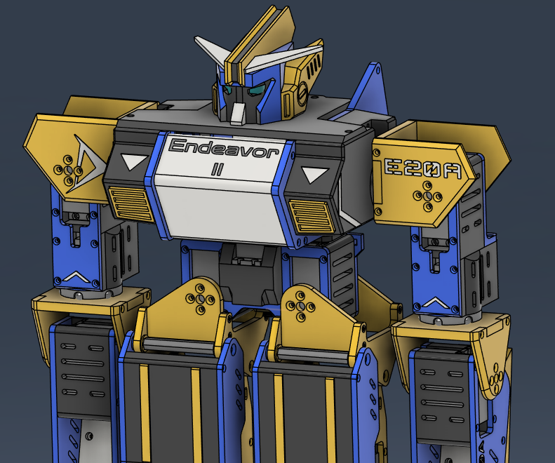

# Endeavor II - 3D Printed Humanoid Robot
This is a 17-degree of freedom mini humanoid robot that can be 3D printed off a standard machine such as an Ender 3, Prusa, or Bambu.  This is the second iteration, which aims to address the shortcomings and design flaws of its predecessor.  While this robot was specifically designed to compete in ROBO-ONE or similar events (e.g. RoboGames), I want to use this as an experimental platform to explore relevant problems within the humanoid robotics field such as dynamic balancing, advanced motion generation, etc.

## Status
**WORK IN PROGRESS**

Version 01: Initial Open Source Release

## Navigation
**Refer to the [STARTHERE.md] in the docs folder for build instructions**

See the [CHANGELOG.md] for milestone updates

## Contributing
I have a [Discord server] where you can leave feedback, get support for your project, and hang out with robotics fanatics!

If you like the work I've done and wish to support me, I also have a [Patreon]!

[STARTHERE.md]:./docs/STARTHERE.md
[CHANGELOG.md]:./CHANGELOG.md
[Discord server]:https://discord.gg/Gm2sCxpUSx
[Patreon]:aaaaaaa