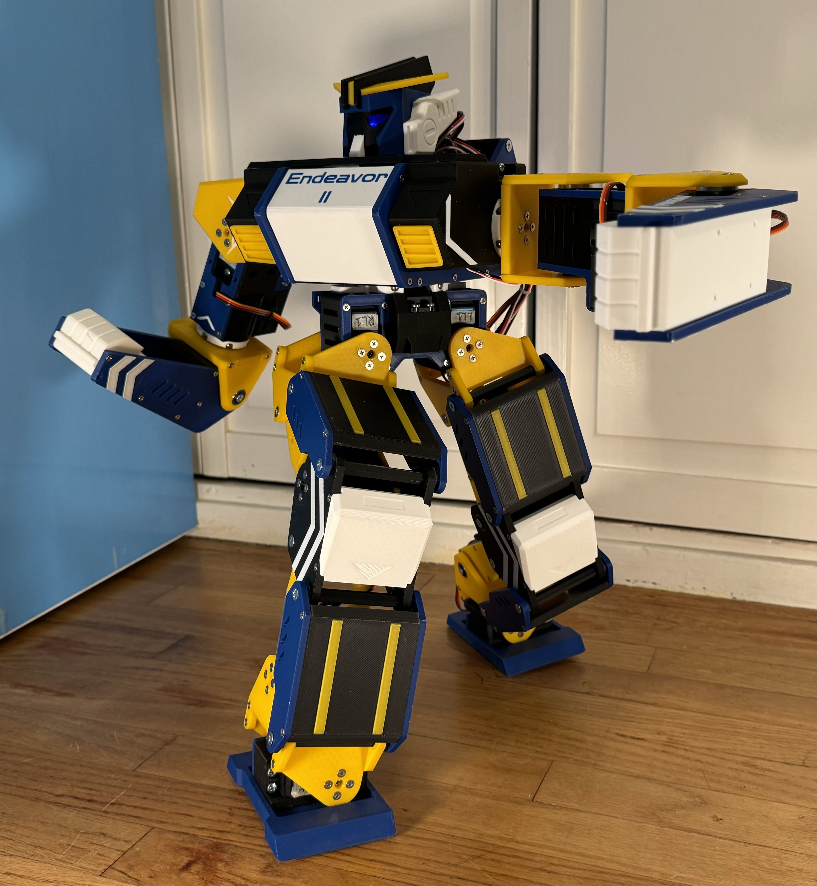
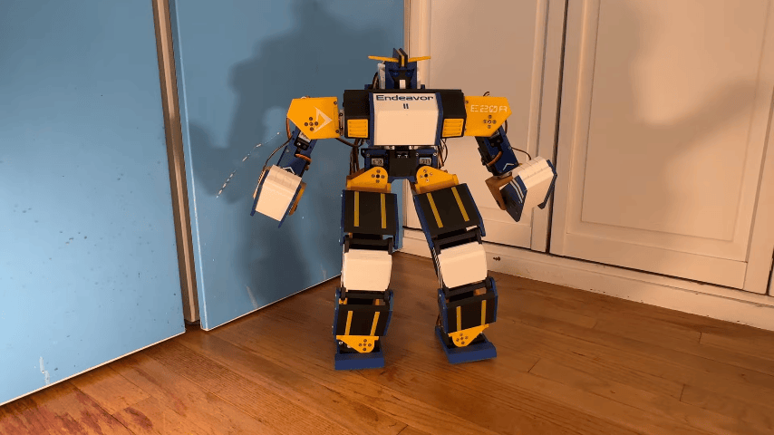
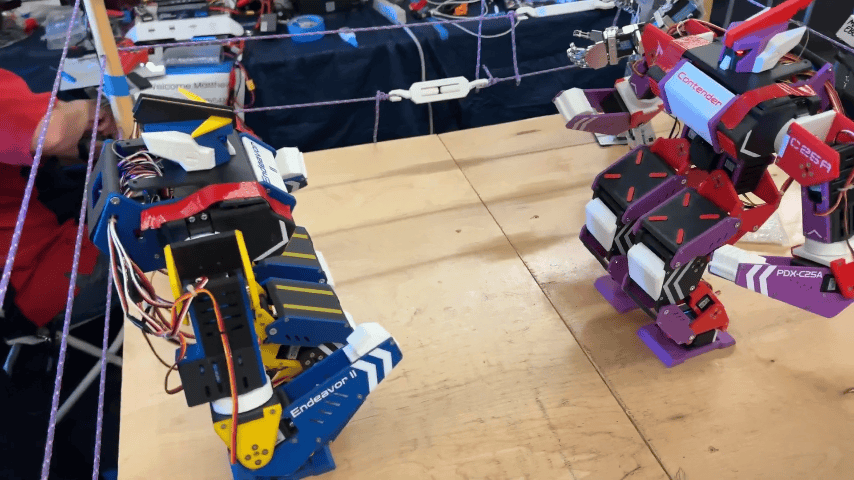

# Endeavor II - 3D Printed Humanoid Robot
Endeavor II is a small scale humanoid robot with a height of 50 cm and 4 kg weight.  This robot is inspired by the Japanese robotics competition ROBO-ONE, and is capable of agile movements, combat-oriented sequences, and dance moves.  It is also designed to be fully 3D printed off standard commercial machines and use commercial off the shelf electronics.  Depending on shipping fees, the cost of this robot ranges between $600 to $800.

Endeavor II is fully open source.  In this repository you will find everythign you need to build and customize your own Endeavor: STEP, STL, and code files.

<p align="center">
  
  
    
</p>

## Latest Update: (DATE)
**Initial Open Source Release!!!**

Version 01: Initial Open Source Release

See the [CHANGELOG.md] for full update history.

## Getting Started
### Installing this repository

Clone this repository to your local machine:
```bash
git clone
git submodule update --init --recursive
```

### Hardware Assembly

1. It is recommended to do the servo calibration before assemblying the robot.  Refer to [ServoCalibration.pdf] for instructions on how to do this.

1. Refer to [AssemblyDoc.pdf] for hardware assembly instructions.

1. Standard for wiring is in the works, but for now you can refer to the following wiring diagram:

<p align="center">
  
</p>


### Software Setup
Refer to [SoftwareSetup.pdf] for software setup instructions

## To-Do List
- [ ] Finish documentation
- [ ] ESP32 controller optimization (phase out ArduinoIDE code)
- [ ] ESPNOW support for PC teleoperation
- [ ] Idk do some cool stuff

## Support Me!

This project was created by ProtoDane Robotics.  If you like this project and wish to support my future works, I would really appreciate if you followed me on my [YouTube channel]!

If you wish to discuss this project with me, I have a [Discord server].


[STARTHERE.md]:./STARTHERE.md
[CHANGELOG.md]:./CHANGELOG.md
[Discord server]:https://discord.gg/Gm2sCxpUSx
[ServoCalibration.pdf]:./docs/ServoCalibration.pdf
[AssemblyDoc.pdf]:./docs/AssemblyDoc.pdf
[Youtube channel]:https://www.youtube.com/@ProtoDane